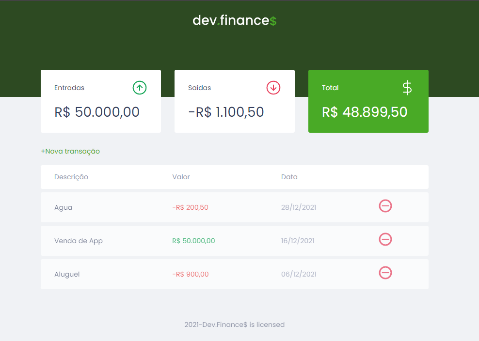

# Finance App

## Tecnologias
- [x] HTML
- [x] CSS
- [x] JavaScript

Essa aplicação foi criada em base a um projeto da [Rocketseat](https://rocketseat.com.br/). 
Aplicação financeira basica com o objetivo de uma aplicação via web.
Com entradas e saidas de dinheiro da conta bancaria.
para organizar o dinheiro e fazer o controle de gastos.

## Funções
- [x] Entrada de dinheiro
    - [ ] Entrada de dinheiro por diferentes formas, dinheiro, cartão, cheque (funcionalidade ainda não implementada)
- [x] Saida de dinheiro
- [x] Controle de gastos
    - [ ] Controle de gastos por diferentes categorias, salário, alimentação, transporte, lazer, educação, outros (funcionalidade ainda não implementada)
    - [ ] Controle visual por datas (funcionalidade ainda não implementada)

Unica biblioteca a parte usada foi o [swal.js](https://github.com/t4t5/sweetalert) para alertas.